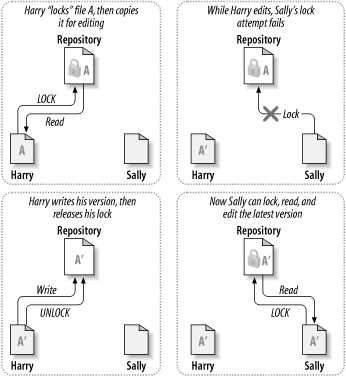

# Solution for the file-sharing Problem

Solution strategy for the team to collaborate with each other.

1. lock-modify-unlock solution
2. copy-modify-merge solution 

## The Lock-modify-unlock strategy

A *lock-modify-unlock model* to address the problem of many authors clobbering each other's work. In this model, the repository allows only one person to change a file at a time. This restriction policy was managed by using locks.

Here is an example, if Harry wants to do some changes in the common file. Then he must “lock” a file before he can begin making changes to it. If Harry has locked a file, then Sally cannot also lock it, and therefore cannot make any changes to that file. All she can do is read the file, and wait for Harry to finish his changes and release his lock. After Harry unlocks the file, Sally can take her turn by locking and editing the file.

**Figure-1** lock-modify-unlock strategy

The problem with the lock-modify-unlock model is that it's a bit restrictive, and often becomes a roadblock for users:

1. Locking may cause *administrative problems*. Sometimes Harry will lock a file and then forget about it. Meanwhile, because Sally is still waiting to edit the file, her hands are tied. And then Harry goes on vacation. Now Sally has to get an administrator to release Harry's lock. The situation ends up causing a lot of unnecessary delay and wasted time.

2. Locking may cause *unnecessary serialization*. What if Harry is editing the beginning of a text file, and Sally simply wants to edit the end of the same file? These changes don't overlap at all. They could easily edit the file simultaneously, and no great harm would come, assuming the changes were properly merged together. There's no need for them to take turns in this situation.

3. Locking may create a *false sense of security*. Suppose Harry locks and edits file A, while Sally simultaneously locks and edits file B. But what if A and B depend on one another, and the changes made to each are semantically incompatible? Suddenly A and B don't work together anymore. The locking system was powerless to prevent the problem—yet it somehow provided a false sense of security. It's easy for Harry and Sally to imagine that by locking files, each is beginning a safe, insulated task, and thus not bother discussing their incompatible changes early on. Locking often becomes a substitute for real communication.

## Copy-modify-merge strategy

A *copy-modify-merge* model as an alternative to locking. In this model, each user's client contacts the project repository and creates a personal working copy—a local reflection of the repository's files and directories. Users then work simultaneously and independently, modifying their private copies. Finally, the private copies are merged together into a new, final version. The version control system often assists with the merging, but ultimately a human being is responsible for making it happen correctly.

Here's an example. Say that Harry and Sally each create working copies of the same project, copied from the repository. They work concurrently and make changes to the same file A within their copies. Sally saves her changes to the repository first. When Harry attempts to save his changes later, the repository informs him that his file A is out-of-date. In other words, file A in the repository has somehow changed since he last copied it. So Harry asks his client to merge any new changes from the repository into his working copy of file A. Chances are that Sally's changes don't overlap with his own; so once he has both sets of changes integrated, he saves his working copy back to the repository.

**Figure-1.1** copyt-modify-merge strategy

**Figure-1.2** copyt-modify-merge strategy (continued)

But what if Sally's changes do overlap with Harry's changes? What then? This situation is called a *conflict*, and it's usually not much of a problem. When Harry asks his client to merge the latest repository changes into his working copy, his copy of file A is somehow flagged as being in a state of conflict: he'll be able to see both sets of conflicting changes, and manually choose between them. Note that software can't automatically resolve conflicts; only humans are capable of understanding and making the necessary intelligent choices. Once Harry has manually resolved the overlapping changes—perhaps after a discussion with Sally—he can safely save the merged file back to the repository.

The copy-modify-merge model may sound a bit chaotic, but in practice, it runs extremely smoothly. Users can work in parallel, never waiting for one another. When they work on the same files, it turns out that most of their concurrent changes don't overlap at all; conflicts are infrequent. And the amount of time it takes to resolve conflicts is usually far less than the time lost by a locking system.

In the end, it all comes down to one critical factor: *user communication*. When users communicate poorly, both syntactic and semantic conflicts increase. No system can force users to communicate perfectly, and no system can detect semantic conflicts. So there's no point in being lulled into a false sense of security that a locking system will somehow prevent conflicts; in practice, locking seems to inhibit productivity more than anything else.

## When Locking is Necessary

While the lock-modify-unlock model is considered generally harmful to collaboration, there are still times when locking is appropriate.

The copy-modify-merge model is based on the assumption that files are contextually mergeable: that is, that the majority of the files in the repository are line-based text files (such as program source code). But for files with binary formats, such as artwork or sound, it's often impossible to merge conflicting changes. In these situations, it really is necessary to users to take strict turns when changing the file. Without serialized access, somebody ends up wasting time on changes that are ultimately discarded.

While Subversion is still primarily a copy-modify-merge system, it still recognizes the need to lock an occasional file and thus provide mechanisms for this. The mechanism is called **"Locking"**